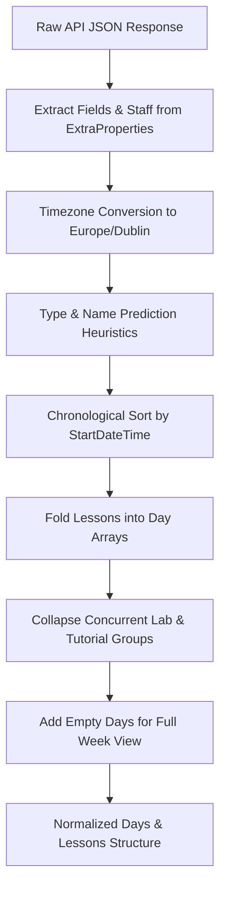

# Data Transformation & Processing Pipeline

This document explains the data pipeline that turns raw, unstructured, and noisy responses from the Scientia EU Timetabling API into clean, organized, and display-ready lesson objects.

---

## 1. Pipeline Overview



---

## 2. Field Extraction and Normalization

Raw API event entries contain nested and non-standard fields. The transformer extracts and normalizes the following properties:

| Raw Property | Normalized Property | Transformation Logic |
|---|---|---|
| `StartDateTime` | `StartDateTime` | Converted to `moment.tz(val, "Europe/Dublin")` |
| `EndDateTime` | `EndDateTime` | Converted to `moment.tz(val, "Europe/Dublin")` |
| `Location` | `Location` | Preserved as string (e.g., `"CQ-008 Central Quad"`) |
| `Description` | `Description` | Sanitized with spelling corrector, falls back to `predictLessonShortName(Name)` |
| `Name` | `Name` | Raw module/event code string (e.g. `CMPU2016/Lecture/01`) |
| `EventType` | `EventType` | Uses API value if present; otherwise infers via `predictLessonType(Name)` |
| `ExtraProperties` | `staffName` | Extracted by searching property with `prop.Name === "Staff"` |

---

## 3. String Heuristics & Inference Algorithms

Universities frequently enter timetable items without explicit event types or clean titles. Heuristic parsers analyze slash-delimited naming conventions (e.g., `PROGRAM/MODULE_TITLE/EVENT_TYPE/GROUP_NUMBER`).

### 3.1 Event Type Prediction (`predictLessonType`)
Recognized event types include:
`Lecture`, `Tutorial`, `Laboratory`, `Studio`, `Kitchen`, `Music`, `Off-site`, `Clinical`.

```javascript
export const predictLessonType = (lessonName) => {
    lessonName = removeGroupSpecFromName(lessonName);

    const nameParts = lessonName.split("/");
    if (nameParts.length < 2) return "";
    const preLastPart = nameParts[nameParts.length - 2];
    const eventType = findMatchingEventType(preLastPart);
    return eventType;
};
```

### 3.2 Short Name Prediction (`predictLessonShortName`)
Strips out sub-group specifications, semester tags (`sem1`, `sem2`), and event types to extract the human-readable subject name:

```javascript
export const predictLessonShortName = (lessonName) => {
    lessonName = removeGroupSpecFromName(lessonName);
    lessonName = removeSemFromName(lessonName);
    lessonName = removeEventTypeFromName(lessonName);
    let [lastPart] = getLastPartFromName(lessonName);
    lastPart = String(lastPart).trim();
    return capitalizeFirstLetter(lastPart);
};
```

### 3.3 Text Sanitization & Typo Corrections (`fixDescr`)
Corrects known database transcription typos before displaying:
```javascript
const replaceFix = {
    Systesm: "Systems",
    Devleopment: "Development",
};

export const fixDescr = (description) => {
    for (const key in replaceFix) {
        description = description.replaceAll(key, replaceFix[key]);
    }
    return description;
};
```

---

## 4. Lab & Multi-Group Collapsing Algorithm (`collapseLabGroups`)

In many academic timetables, a lab or tutorial runs simultaneously for multiple cohorts (e.g., Group A in Room 101 with Lecturer 1, Group B in Room 102 with Lecturer 2). Without collapsing, the UI renders conflicting overlapping cards.

### Logic:
1. Two lessons are considered the same if:
   - `StartDateTime` matches exactly.
   - `EndDateTime` matches exactly.
   - `EventType` matches.
   - Either `Description` matches or their base names match (excluding `/Group A` suffix).
2. When a match is detected:
   - Sets `collapsedLocations = true` on the primary card.
   - Aggregates all locations into a `Locations` array:
     ```json
     {
       "Locations": [
         { "nameSpecification": "Group A", "location": "CQ-112", "staffName": "Grace Hopper" },
         { "nameSpecification": "Group B", "location": "CQ-114", "staffName": "Margaret Hamilton" }
       ]
     }
     ```
3. Single group events retain their standard single-location layout.

---

## 5. Day Bucketing & Week Padding (`addEmptyDays`)

To support ISO week views where weekends or free days must still render empty columns or timeline tracks:

1. Iterates from `weekStart.startOf('isoWeek')` to `weekStart.endOf('isoWeek')`.
2. Matches each day against existing lessons array.
3. If no events exist for a day, an empty day bucket `{ day: momentDate, lessons: [] }` is inserted.

---

## 6. Output Data Model

```typescript
interface StaffLocation {
  nameSpecification: string | null; // e.g. "Group A"
  location: string | null;          // e.g. "CQ-112 Central Quad"
  locationDetails?: string[];       // e.g. ["Central Quad"]
  staffName?: string | null;        // e.g. "Dr. Alan Turing"
}

interface NormalizedLesson {
  StartDateTime: moment.Moment;
  EndDateTime: moment.Moment;
  Location: string | null;
  Description: string;
  Name: string;
  EventType: string;
  staffName?: string | null;
  collapsedLocations?: boolean;
  Locations?: StaffLocation[];
}

interface DayData {
  day: moment.Moment;
  lessons: NormalizedLesson[];
}

type WeekSchedule = DayData[];
```
