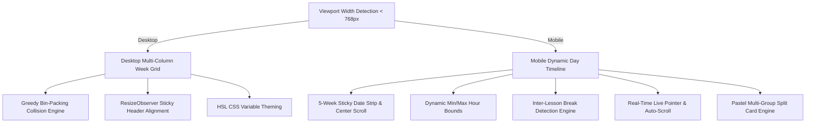

# Display & Layout Framework

This document outlines the visual rendering engines, coordinate calculations, collision-avoidance algorithms, and theming systems powering both Desktop and Mobile views.

---

## 1. Dual-Mode Architecture

The application adopts two specialized layouts optimized for different form factors:



---

## 2. Desktop Layout Engine

### 2.1 Coordinate & Height Mapping
The desktop grid converts timestamps into vertical `rem` offsets based on fixed scale variables:

- `fromTime`: Start hour of daily grid (default: `8` -> 8:00 AM)
- `endTime`: End hour of daily grid (default: `22` -> 10:00 PM)
- `hourLen`: Height per hour unit (default: `9rem`)

```javascript
// Height & vertical positioning formulas
const duration = content.EndDateTime.diff(content.StartDateTime) * (1 / (1000 * 60 * 60));
const topMargin = content.StartDateTime.diff(prevEndTime) * (1 / (1000 * 60 * 60));

element.style.height = `${duration * hourLen}rem`;
element.style.marginTop = `${topMargin * hourLen}rem`;
```

### 2.2 Greedy Column Bin-Packing for Overlapping Lessons (`Container` Class)
When multiple lessons overlap in time within the same day, they cannot be rendered on top of each other. The layout engine splits overlapping blocks into distinct side-by-side columns:

```javascript
class Container {
    constructor(lesson) {
        this.startTime = lesson.StartDateTime;
        this.endTime = lesson.EndDateTime;
        this.columns = [{ lessons: [lesson], columnEndTime: this.endTime }];
    }

    containsLesson(lesson) {
        return lesson.StartDateTime < this.endTime; 
    }

    addLesson(lesson) {
        if (this.endTime < lesson.EndDateTime) {
            this.endTime = lesson.EndDateTime;
        }

        let foundColumn = false;
        let i = 0;
        while (!foundColumn && i < this.columns.length) {
            const curColumn = this.columns[i];
            // If previous lesson in this column ended before the new lesson starts
            if (curColumn.columnEndTime <= lesson.StartDateTime) {
                curColumn.lessons.push(lesson);
                curColumn.columnEndTime = lesson.EndDateTime;
                foundColumn = true;
            }
            i++;
        }

        // If all existing columns have conflicts, open a new column
        if (!foundColumn) {
            this.columns.push({
                lessons: [lesson],
                columnEndTime: lesson.EndDateTime
            });
        }
    }
}
```

### 2.3 Sticky Header Width Synchronization (`ResizeObserver`)
Because the desktop lesson schedule has a custom scrollbar that varies across operating systems (Windows vs macOS), a `ResizeObserver` measures both the left time column and right scrollbar offsets in real-time, syncing the fixed header columns with zero layout jitter.

### 2.4 Hover Popup Viewport Flipping
Lesson popups check `leftSide = (dayIndex < totalDays / 2 - 1)`. 
- For left-side days, popups render to the right (`left: 100%`).
- For right-side days, popups flip to the left (`right: 100%`), preventing off-screen clipping.

---

## 3. Mobile Layout Engine

### 3.1 Dynamic Time Boundaries
Instead of rendering empty rows from 8 AM to 10 PM on light days, the mobile engine dynamically scans scheduled classes for the active day and trims the timeline:
```javascript
let minH = 8;
let maxH = 20;

lessons.forEach((l) => {
    const sh = l.StartDateTime.hour();
    const eh = l.EndDateTime.hour();
    if (sh < minH) minH = sh;
    if (eh > maxH) maxH = eh;
});
```

### 3.2 Automated Break Detection
Gaps between consecutive classes greater than 6 minutes (`> 0.1 hours`) are detected and rendered as break cards with calculated free time:
```javascript
const breakLength = lessons[i].StartDateTime.diff(lessons[i - 1].EndDateTime, "hours", true);
if (breakLength > 0.1) {
    breaks.push({
        start: lessons[i - 1].EndDateTime,
        end: lessons[i].StartDateTime,
    });
}
```

### 3.3 Live Time Pointer & Automatic Launch Scrolling
- Runs a 15-second tick interval using `moment-timezone`.
- Computes exact pixel offset (`top = el.offsetTop + fraction * el.offsetHeight`) for the current minute.
- On launch or switching to today, automatically performs a smooth scroll to center the live time indicator on screen.

### 3.4 5-Week Horizontal Date Strip
- Generates 35 days (5 weeks) from the current date.
- Employs horizontal scroll with arrow buttons and `scrollIntoView` centering.
- Indicates days containing lessons with subtle dot badges.

### 3.5 Multi-Group Concurrent Cards (Split Grid)
When lab sessions run simultaneously for multiple sub-groups, the mobile card splits into:
- **Left Primary Card**: Course title, event type, time range, and lecturer initials.
- **Right Split Sidebar**: Colored badges for each sub-group (e.g. `Group A — CQ-112`, `Group B — CQ-114`).

---

## 4. Color & Theming System

### 4.1 HSL Tokens for Desktop Event Types
```javascript
const lessonColors = {
    assigned: {
        lecture: "206, 100%, 50%",    // Vibrant Blue
        tutorial: "108, 79%, 51%",    // Fresh Green
        laboratory: "286, 100%, 55%", // Rich Purple
        studio: "44, 100%, 48%",      // Warm Amber
        kitchen: "71, 94%, 42%",      // Olive Lime
        music: "324, 100%, 48%",      // Magenta
        "off-site": "335, 100%, 48%", // Crimson
        clinical: "355, 100%, 71%",   // Coral Red
    },
    default: "198, 100%, 21%",
};
```

### 4.2 Mobile Pastel Card Color Schemes
Each category features tailored dark and light mode background surfaces, borders, and accent pills:

```javascript
const pastelThemes = {
    lecture: {
        bgLight: "#E5EDF4",
        bgDark: "#223954",
        accent: "#2563EB",
        pillBg: "rgba(37, 99, 235, 0.12)",
        border: "rgba(37, 99, 235, 0.22)",
    },
    laboratory: {
        bgLight: "#F0E8F5",
        bgDark: "#3B2A56",
        accent: "#9333EA",
        pillBg: "rgba(147, 51, 234, 0.12)",
        border: "rgba(147, 51, 234, 0.22)",
    },
    tutorial: {
        bgLight: "#E8F2E6",
        bgDark: "#20442E",
        accent: "#16A34A",
        pillBg: "rgba(22, 163, 74, 0.12)",
        border: "rgba(22, 163, 74, 0.22)",
    },
    // ...
};
```
